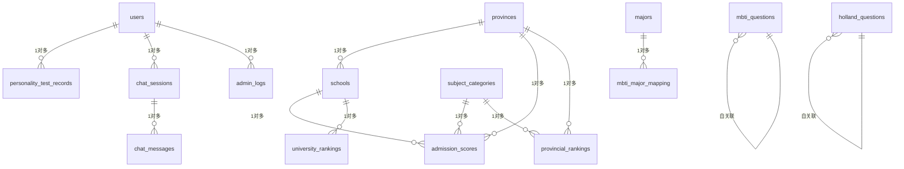

# 🗃️ 高考志愿填报助手 - 实体类与数据库设计

## 📋 概述

本文档详细描述了高考志愿填报助手系统的实体类设计和数据库表结构。系统采用JPA/Hibernate作为ORM框架，使用MySQL 8.0作为主数据库。

## 🏗️ 数据库表结构总览

| 表名 | 中文名称 | 主要功能 | 状态 |
|------|----------|----------|------|
| `users` | 用户表 | 存储用户基本信息 | ✅ 已实现 |
| `provinces` | 省份表 | 存储省份信息和考试类型 | ✅ 已实现 |
| `subject_categories` | 科类表 | 存储文理科等科类信息 | ✅ 已实现 |
| `schools` | 学校表 | 存储高校基本信息 | ✅ 已实现 |
| `admission_scores` | 录取分数表 | 存储历年录取分数数据 | ✅ 已实现 |
| `provincial_rankings` | 一分一段表 | 存储各省份分数排名数据 | ✅ 已实现 |
| `university_rankings` | 大学排名表 | 存储大学排名信息 | ✅ 已实现 |
| `majors` | 专业表 | 存储专业基本信息 | ✅ 已实现 |
| `mbti_questions` | MBTI测试题表 | 存储MBTI性格测试题目 | ✅ 已实现 |
| `holland_questions` | 霍兰德测试题表 | 存储霍兰德兴趣测试题目 | ✅ 已实现 |
| `personality_test_records` | 测试记录表 | 存储用户测试结果 | ✅ 已实现 |
| `mbti_descriptions` | MBTI描述表 | 存储MBTI类型详细描述 | ✅ 已实现 |
| `mbti_major_mapping` | MBTI专业匹配表 | 存储MBTI与专业匹配关系 | ✅ 已实现 |
| `chat_sessions` | 聊天会话表 | 存储AI对话会话信息 | ✅ 已实现 |
| `chat_messages` | 聊天消息表 | 存储AI对话消息记录 | ✅ 已实现 |
| `admin_logs` | 管理员日志表 | 存储管理员操作日志 | ✅ 已实现 |

## 1️⃣ 核心基础实体类

### 1.1 User (用户实体) 👤

**表名**: `users`
**功能**: 存储系统用户的基本信息，采用简化设计，只包含核心字段

```java
@Entity
@Table(name = "users")
@Data
@NoArgsConstructor
@AllArgsConstructor
public class User {

    /**
     * 用户ID, 主键
     */
    @Id
    @GeneratedValue(strategy = GenerationType.IDENTITY)
    @Column(name = "id", nullable = false)
    private Long id;

    /**
     * 用户名, 唯一（区分大小写）
     */
    @Column(name = "username", nullable = false, unique = true, length = 50,
            columnDefinition = "VARCHAR(50) COLLATE utf8_bin")
    private String username;

    /**
     * 加密后的密码
     */
    @Column(name = "password", nullable = false, length = 255)
    private String password;

    /**
     * 账户创建时间
     */
    @CreationTimestamp
    @Column(name = "created_at")
    private LocalDateTime createdAt;
}
```

**设计特点**:
- 用户名区分大小写，使用`utf8_bin`排序规则
- 密码使用BCrypt加密存储
- 采用简化设计，避免过度复杂化

### 1.2 Province (省份实体) 🗺️

**表名**: `provinces`
**功能**: 存储全国各省份信息及其高考模式类型

```java
@Entity
@Table(name = "provinces")
@Data
@NoArgsConstructor
@AllArgsConstructor
public class Province {

    /**
     * 省份ID, 主键
     */
    @Id
    @GeneratedValue(strategy = GenerationType.IDENTITY)
    @Column(name = "id", nullable = false)
    private Integer id;

    /**
     * 省份名称, 如: 安徽省
     */
    @Column(name = "name", nullable = false, length = 100)
    private String name;

    /**
     * 省份考试类型
     * 0: 新高考3+3模式 (浙江、上海等)
     * 1: 新高考3+1+2模式或传统文理分科 (大部分省份)
     * 2: 其他特殊模式
     */
    @Column(name = "provinceExamType")
    private Integer provinceExamType;
}
```

**设计特点**:
- 支持不同高考模式的区分
- 为后续扩展预留了特殊模式类型
- 暂时移除了关联关系，避免循环引用

### 1.3 SubjectCategory (科类实体) 📚

**表名**: `subject_categories`
**功能**: 存储高考科类信息，如文科、理科、新高考选科组合等

```java
@Entity
@Table(name = "subject_categories")
@Data
@NoArgsConstructor
@AllArgsConstructor
public class SubjectCategory {

    /**
     * 科类ID, 主键
     */
    @Id
    @GeneratedValue(strategy = GenerationType.IDENTITY)
    @Column(name = "id", nullable = false)
    private Integer id;

    /**
     * 科类名称, 如: 理科, 文科, 物理类, 历史类
     */
    @Column(name = "name", nullable = false, length = 50)
    private String name;

    /**
     * 科类代码, 如: LK, WK, WL, LS
     */
    @Column(name = "code", length = 20)
    private String code;

    /**
     * 科类描述
     */
    @Column(name = "description", columnDefinition = "TEXT")
    private String description;
}
```

### 1.4 School (学校实体) 🏫

**表名**: `schools`
**功能**: 存储全国高等院校的基本信息

```java
@Entity
@Table(name = "schools")
@Data
@NoArgsConstructor
@AllArgsConstructor
public class School {

    /**
     * 学校ID, 主键
     */
    @Id
    @GeneratedValue(strategy = GenerationType.IDENTITY)
    @Column(name = "id", nullable = false, columnDefinition = "INT COMMENT '学校ID, 主键'")
    private Integer id;

    /**
     * 学校官方名称
     */
    @Column(name = "name", nullable = false, length = 255,
            columnDefinition = "VARCHAR(255) NOT NULL COMMENT '学校官方名称'")
    private String name;

    /**
     * 学校所在省份ID, 关联provinces表
     */
    @Column(name = "province_id", columnDefinition = "INT COMMENT '学校所在省份ID, 关联provinces表'")
    private Integer provinceId;

    /**
     * 办学层次, 如: 本科, 专科
     */
    @Column(name = "schoolLevel", length = 50,
            columnDefinition = "VARCHAR(50) COMMENT '办学层次, 如: 本科, 专科'")
    private String schoolLevel;

    /**
     * 办学类型, 如: 公办, 民办, 中外合作办学
     */
    @Column(name = "schoolType", length = 50,
            columnDefinition = "VARCHAR(50) COMMENT '办学类型, 如: 公办, 民办, 中外合作办学'")
    private String schoolType;

    /**
     * 学校特色标签, 如: 985, 211, 双一流, 强基计划
     */
    @Column(name = "schoolFeature", length = 100,
            columnDefinition = "VARCHAR(100) COMMENT '学校特色标签, 如: 985, 211, 双一流, 强基计划'")
    private String schoolFeature;

    /**
     * 学校官网地址
     */
    @Column(name = "website", length = 255,
            columnDefinition = "VARCHAR(255) COMMENT '学校官网地址'")
    private String website;

    /**
     * 学校简介
     */
    @Column(name = "description", columnDefinition = "TEXT COMMENT '学校简介'")
    private String description;
}
```

**设计特点**:
- 包含学校的基本属性和特色标签
- 支持不同办学层次和类型的区分
- 预留了网站和描述字段用于扩展

## 2️⃣ 数据分析相关实体类

### 2.1 AdmissionScore (录取分数实体) 📊

**表名**: `admission_scores`
**功能**: 存储历年各高校在各省份的录取分数数据，是预测算法的核心数据源

```java
@Entity
@Table(name = "admission_scores",
       indexes = {
           @Index(name = "idx_scores_query",
                  columnList = "year, school_id, province_id, subject_category_id")
       })
@Data
@NoArgsConstructor
@AllArgsConstructor
public class AdmissionScore {

    /**
     * 记录ID, 主键
     */
    @Id
    @GeneratedValue(strategy = GenerationType.IDENTITY)
    @Column(name = "id", nullable = false, columnDefinition = "BIGINT COMMENT '记录ID, 主键'")
    private Long id;

    /**
     * 年份
     */
    @Column(name = "year", nullable = false, columnDefinition = "INT NOT NULL COMMENT '年份'")
    private Integer year;

    /**
     * 学校ID, 关联schools表
     */
    @Column(name = "school_id", nullable = false, columnDefinition = "INT NOT NULL COMMENT '学校ID, 关联schools表'")
    private Integer schoolId;

    /**
     * 考生生源地省份ID, 关联provinces表
     */
    @Column(name = "province_id", nullable = false,
            columnDefinition = "INT NOT NULL COMMENT '考生生源地省份ID, 关联provinces表'")
    private Integer provinceId;

    /**
     * 科类ID, 关联subject_categories表
     */
    @Column(name = "subject_category_id", nullable = false,
            columnDefinition = "INT NOT NULL COMMENT '科类ID, 关联subject_categories表'")
    private Integer subjectCategoryId;

    /**
     * 最低录取分
     */
    @Column(name = "min_score", columnDefinition = "FLOAT COMMENT '最低录取分'")
    private Float minScore;

    /**
     * 最低分位次
     */
    @Column(name = "min_rank", columnDefinition = "INT COMMENT '最低分位次'")
    private Integer minRank;
}
```

**设计特点**:
- 添加了复合索引优化查询性能
- 支持多年份、多省份、多科类的数据存储
- 为预测算法提供核心数据支撑

### 2.2 ProvincialRanking (一分一段实体) 📈

**表名**: `provincial_rankings`
**功能**: 存储各省份的一分一段数据，用于分数位次转换

```java
@Entity
@Table(name = "provincial_rankings")
@Data
@NoArgsConstructor
@AllArgsConstructor
public class ProvincialRanking {

    /**
     * 记录ID, 主键
     */
    @Id
    @GeneratedValue(strategy = GenerationType.IDENTITY)
    @Column(name = "id", nullable = false)
    private Long id;

    /**
     * 年份
     */
    @Column(name = "year", nullable = false)
    private Integer year;

    /**
     * 省份ID, 关联provinces表
     */
    @Column(name = "province_id", nullable = false)
    private Integer provinceId;

    /**
     * 科类ID, 关联subject_categories表
     */
    @Column(name = "subject_category_id", nullable = false)
    private Integer subjectCategoryId;

    /**
     * 分数
     */
    @Column(name = "score", nullable = false)
    private Integer score;

    /**
     * 该分数的人数
     */
    @Column(name = "count_at_score", nullable = false)
    private Integer countAtScore;

    /**
     * 累计人数（该分数及以上的总人数）
     */
    @Column(name = "cumulative_count", nullable = false)
    private Integer cumulativeCount;
}
```

### 2.3 UniversityRanking (大学排名实体) 🏆

**表名**: `university_rankings`
**功能**: 存储各种大学排名数据，用于推荐算法的评分

```java
@Entity
@Table(name = "university_rankings")
@Data
@NoArgsConstructor
@AllArgsConstructor
public class UniversityRanking {

    /**
     * 记录ID, 主键
     */
    @Id
    @GeneratedValue(strategy = GenerationType.IDENTITY)
    @Column(name = "id", nullable = false)
    private Integer id;

    /**
     * 学校ID, 关联schools表
     */
    @Column(name = "school_id", nullable = false)
    private Integer schoolId;

    /**
     * 排名类型, 如: QS, 软科, 校友会
     */
    @Column(name = "ranking_type", nullable = false, length = 50)
    private String rankingType;

    /**
     * 排名值
     */
    @Column(name = "rank_value", nullable = false)
    private Integer rankValue;

    /**
     * 排名年份
     */
    @Column(name = "year", nullable = false)
    private Integer year;
}
```

### 2.4 Major (专业实体) 🎓

**表名**: `majors`
**功能**: 存储专业基本信息，用于专业推荐和匹配

```java
@Entity
@Table(name = "majors")
@Data
@NoArgsConstructor
@AllArgsConstructor
public class Major {

    /**
     * 专业ID, 主键
     */
    @Id
    @GeneratedValue(strategy = GenerationType.IDENTITY)
    @Column(name = "id", nullable = false)
    private Integer id;

    /**
     * 专业名称
     */
    @Column(name = "name", nullable = false, length = 100)
    private String name;

    /**
     * 专业代码
     */
    @Column(name = "code", length = 20)
    private String code;

    /**
     * 专业类别
     */
    @Column(name = "category", length = 50)
    private String category;

    /**
     * 专业描述
     */
    @Column(name = "description", columnDefinition = "TEXT")
    private String description;

    /**
     * 就业前景
     */
    @Column(name = "employment_prospects", columnDefinition = "TEXT")
    private String employmentProspects;
}
```

## 3️⃣ 性格测试相关实体类

### 3.1 MbtiQuestion (MBTI测试题实体) 🧠

**表名**: `mbti_questions`
**功能**: 存储MBTI性格测试的题目和评分规则

```java
@Entity
@Table(name = "mbti_questions")
@Data
@NoArgsConstructor
@AllArgsConstructor
public class MbtiQuestion {

    @Id
    @GeneratedValue(strategy = GenerationType.IDENTITY)
    private Integer id;

    /**
     * 题目内容
     */
    @Column(name = "question_text", nullable = false, columnDefinition = "TEXT")
    private String questionText;

    /**
     * 选项A
     */
    @Column(name = "option_a", nullable = false)
    private String optionA;

    /**
     * 选项B
     */
    @Column(name = "option_b", nullable = false)
    private String optionB;

    /**
     * 测试维度：EI(外向-内向), SN(感觉-直觉), TF(思考-情感), JP(判断-感知)
     */
    @Enumerated(EnumType.STRING)
    @Column(name = "dimension", nullable = false)
    private MbtiDimension dimension;

    /**
     * 选择A的得分
     */
    @Column(name = "a_score", nullable = false)
    private Integer aScore;

    /**
     * 选择B的得分
     */
    @Column(name = "b_score", nullable = false)
    private Integer bScore;

    /**
     * 题目顺序
     */
    @Column(name = "question_order", nullable = false)
    private Integer questionOrder;

    /**
     * 创建时间
     */
    @Column(name = "created_at")
    private LocalDateTime createdAt;

    /**
     * MBTI维度枚举
     */
    public enum MbtiDimension {
        EI, // 外向-内向
        SN, // 感觉-直觉
        TF, // 思考-情感
        JP  // 判断-感知
    }

    @PrePersist
    protected void onCreate() {
        createdAt = LocalDateTime.now();
    }
}
```

### 3.2 HollandQuestion (霍兰德测试题实体) 🎯

**表名**: `holland_questions`
**功能**: 存储霍兰德兴趣测试的题目和分类

```java
@Entity
@Table(name = "holland_questions")
@Data
@NoArgsConstructor
@AllArgsConstructor
public class HollandQuestion {

    @Id
    @GeneratedValue(strategy = GenerationType.IDENTITY)
    private Integer id;

    /**
     * 题目内容
     */
    @Column(name = "question_text", nullable = false, columnDefinition = "TEXT")
    private String questionText;

    /**
     * 霍兰德类型：R(现实型), I(研究型), A(艺术型), S(社会型), E(企业型), C(常规型)
     */
    @Enumerated(EnumType.STRING)
    @Column(name = "category", nullable = false)
    private HollandCategory category;

    /**
     * 题目权重
     */
    @Column(name = "weight", nullable = false)
    private Integer weight;

    /**
     * 题目顺序
     */
    @Column(name = "question_order", nullable = false)
    private Integer questionOrder;

    /**
     * 创建时间
     */
    @Column(name = "created_at")
    private LocalDateTime createdAt;

    /**
     * 霍兰德类型枚举
     */
    public enum HollandCategory {
        R, // 现实型 (Realistic)
        I, // 研究型 (Investigative)
        A, // 艺术型 (Artistic)
        S, // 社会型 (Social)
        E, // 企业型 (Enterprising)
        C  // 常规型 (Conventional)
    }

    @PrePersist
    protected void onCreate() {
        createdAt = LocalDateTime.now();
    }
}
```

### 3.3 PersonalityTestRecord (测试记录实体) 📝

**表名**: `personality_test_records`
**功能**: 存储用户的性格测试结果和推荐专业

```java
@Entity
@Table(name = "personality_test_records")
@Data
@NoArgsConstructor
@AllArgsConstructor
public class PersonalityTestRecord {

    @Id
    @GeneratedValue(strategy = GenerationType.IDENTITY)
    private Long id;

    /**
     * 用户ID
     */
    @Column(name = "user_id", nullable = false)
    private Long userId;

    /**
     * 测试类型：MBTI, HOLLAND
     */
    @Column(name = "test_type", nullable = false, length = 20)
    private String testType;

    /**
     * 测试结果，JSON格式存储
     */
    @Column(name = "results", columnDefinition = "JSON")
    private String results;

    /**
     * 推荐专业列表，JSON格式存储
     */
    @Column(name = "recommended_majors", columnDefinition = "JSON")
    private String recommendedMajors;

    /**
     * 测试时间
     */
    @Column(name = "test_time")
    private LocalDateTime testTime;

    @PrePersist
    protected void onCreate() {
        testTime = LocalDateTime.now();
    }
}
```

### 3.4 MbtiDescription (MBTI描述实体) 📖

**表名**: `mbti_descriptions`
**功能**: 存储16种MBTI类型的详细描述信息

```java
@Entity
@Table(name = "mbti_descriptions")
@Data
@NoArgsConstructor
@AllArgsConstructor
public class MbtiDescription {

    @Id
    @GeneratedValue(strategy = GenerationType.IDENTITY)
    private Integer id;

    /**
     * MBTI类型，如：INTJ, ENFP等
     */
    @Column(name = "mbti_type", nullable = false, length = 4, unique = true)
    private String mbtiType;

    /**
     * 类型名称，如：建筑师, 竞选者等
     */
    @Column(name = "type_name", nullable = false, length = 50)
    private String typeName;

    /**
     * 详细描述
     */
    @Column(name = "description", columnDefinition = "TEXT")
    private String description;

    /**
     * 性格特征，JSON格式存储
     */
    @Column(name = "traits", columnDefinition = "JSON")
    private String traits;

    /**
     * 优势
     */
    @Column(name = "strengths", columnDefinition = "TEXT")
    private String strengths;

    /**
     * 劣势
     */
    @Column(name = "weaknesses", columnDefinition = "TEXT")
    private String weaknesses;

    /**
     * 适合的职业方向
     */
    @Column(name = "suitable_careers", columnDefinition = "TEXT")
    private String suitableCareers;
}
```

### 3.5 MbtiMajorMapping (MBTI专业匹配实体) 🎯

**表名**: `mbti_major_mapping`
**功能**: 存储MBTI类型与专业的匹配关系和匹配度

```java
@Entity
@Table(name = "mbti_major_mapping")
@Data
@NoArgsConstructor
@AllArgsConstructor
public class MbtiMajorMapping {

    @Id
    @GeneratedValue(strategy = GenerationType.IDENTITY)
    private Integer id;

    /**
     * MBTI类型
     */
    @Column(name = "mbti_type", nullable = false, length = 4)
    private String mbtiType;

    /**
     * 专业ID，关联majors表
     */
    @Column(name = "major_id", nullable = false)
    private Integer majorId;

    /**
     * 匹配度分数 (0-100)
     */
    @Column(name = "match_score", nullable = false)
    private Integer matchScore;

    /**
     * 匹配原因说明
     */
    @Column(name = "match_reason", columnDefinition = "TEXT")
    private String matchReason;

    /**
     * 创建时间
     */
    @Column(name = "created_at")
    private LocalDateTime createdAt;

    @PrePersist
    protected void onCreate() {
        createdAt = LocalDateTime.now();
    }
}
```

## 4️⃣ AI对话相关实体类

### 4.1 ChatSession (聊天会话实体) 💬

**表名**: `chat_sessions`
**功能**: 存储AI对话的会话信息，管理用户与AI的对话上下文

```java
@Entity
@Table(name = "chat_sessions")
@Data
@NoArgsConstructor
@AllArgsConstructor
public class ChatSession {

    @Id
    @GeneratedValue(strategy = GenerationType.IDENTITY)
    private Long id;

    /**
     * 用户ID
     */
    @Column(name = "user_id", nullable = false)
    private Long userId;

    /**
     * 会话唯一标识
     */
    @Column(name = "session_id", nullable = false, unique = true, length = 100)
    private String sessionId;

    /**
     * 会话标题
     */
    @Column(name = "title", length = 200)
    private String title;

    /**
     * 会话状态：ACTIVE, CLOSED
     */
    @Column(name = "status", length = 20, nullable = false)
    private String status;

    /**
     * 创建时间
     */
    @Column(name = "created_at")
    private LocalDateTime createdAt;

    /**
     * 最后更新时间
     */
    @Column(name = "updated_at")
    private LocalDateTime updatedAt;

    @PrePersist
    protected void onCreate() {
        createdAt = LocalDateTime.now();
        updatedAt = LocalDateTime.now();
        if (status == null) {
            status = "ACTIVE";
        }
    }

    @PreUpdate
    protected void onUpdate() {
        updatedAt = LocalDateTime.now();
    }
}
```

### 4.2 ChatMessage (聊天消息实体) 💭

**表名**: `chat_messages`
**功能**: 存储AI对话的具体消息内容

```java
@Entity
@Table(name = "chat_messages")
@Data
@NoArgsConstructor
@AllArgsConstructor
public class ChatMessage {

    @Id
    @GeneratedValue(strategy = GenerationType.IDENTITY)
    private Long id;

    /**
     * 会话ID，关联chat_sessions表
     */
    @Column(name = "session_id", nullable = false)
    private Long sessionId;

    /**
     * 消息类型：user(用户消息), assistant(AI回复)
     */
    @Column(name = "message_type", nullable = false, length = 20)
    private String messageType;

    /**
     * 消息内容
     */
    @Column(name = "content", columnDefinition = "TEXT")
    private String content;

    /**
     * 消息时间戳
     */
    @Column(name = "timestamp")
    private LocalDateTime timestamp;

    /**
     * 创建时间
     */
    @Column(name = "created_at")
    private LocalDateTime createdAt;

    @PrePersist
    protected void onCreate() {
        createdAt = LocalDateTime.now();
        if (timestamp == null) {
            timestamp = LocalDateTime.now();
        }
    }
}
```

## 5️⃣ 管理相关实体类

### 5.1 AdminLog (管理员日志实体) 📋

**表名**: `admin_logs`
**功能**: 记录管理员的操作日志，用于系统审计和安全监控

```java
@Entity
@Table(name = "admin_logs")
@Data
@NoArgsConstructor
@AllArgsConstructor
public class AdminLog {

    @Id
    @GeneratedValue(strategy = GenerationType.IDENTITY)
    private Long id;

    /**
     * 管理员用户ID
     */
    @Column(name = "admin_id", nullable = false)
    private Long adminId;

    /**
     * 操作类型：LOGIN, LOGOUT, CREATE, UPDATE, DELETE等
     */
    @Column(name = "action", nullable = false, length = 50)
    private String action;

    /**
     * 操作目标：如表名、功能模块等
     */
    @Column(name = "target", length = 100)
    private String target;

    /**
     * 操作详情，JSON格式存储
     */
    @Column(name = "details", columnDefinition = "JSON")
    private String details;

    /**
     * 操作结果：SUCCESS, FAILED
     */
    @Column(name = "result", length = 20)
    private String result;

    /**
     * 客户端IP地址
     */
    @Column(name = "ip_address", length = 45)
    private String ipAddress;

    /**
     * 用户代理信息
     */
    @Column(name = "user_agent", length = 500)
    private String userAgent;

    /**
     * 操作时间
     */
    @Column(name = "created_at")
    private LocalDateTime createdAt;

    @PrePersist
    protected void onCreate() {
        createdAt = LocalDateTime.now();
        if (result == null) {
            result = "SUCCESS";
        }
    }
}
```

## 6️⃣ 数据库设计特点

### 6.1 设计原则

1. **简化优先**: 避免过度复杂的关联关系，优先使用ID关联
2. **性能考虑**: 为查询频繁的字段添加索引
3. **扩展性**: 预留JSON字段用于存储复杂数据结构
4. **一致性**: 统一的命名规范和字段类型
5. **安全性**: 敏感信息加密存储

### 6.2 索引策略

```sql
-- 录取分数表复合索引
CREATE INDEX idx_scores_query ON admission_scores(year, school_id, province_id, subject_category_id);

-- 一分一段表复合索引
CREATE INDEX idx_ranking_query ON provincial_rankings(year, province_id, subject_category_id, score);

-- 聊天消息表索引
CREATE INDEX idx_chat_session ON chat_messages(session_id, created_at);

-- 测试记录表索引
CREATE INDEX idx_user_test ON personality_test_records(user_id, test_type, test_time);
```

### 6.3 数据类型说明

| 数据类型 | 使用场景 | 说明 |
|----------|----------|------|
| `BIGINT` | 主键ID | 支持大数据量，避免ID溢出 |
| `INT` | 外键、年份、分数 | 常规整数类型 |
| `FLOAT` | 录取分数 | 支持小数点的分数 |
| `VARCHAR` | 名称、标题 | 变长字符串，节省空间 |
| `TEXT` | 描述、内容 | 长文本内容 |
| `JSON` | 复杂数据结构 | 存储测试结果、配置信息等 |
| `DATETIME` | 时间戳 | 精确到秒的时间记录 |

## 🗄️ Repository接口设计

基于实际的实体类，系统提供了完整的数据访问层接口。所有Repository接口都继承自`JpaRepository`，提供基础的CRUD操作。

### 核心Repository接口列表

| Repository接口 | 对应实体 | 主要功能 |
|----------------|----------|----------|
| `UserRepository` | User | 用户数据访问 |
| `ProvinceRepository` | Province | 省份数据访问 |
| `SubjectCategoryRepository` | SubjectCategory | 科类数据访问 |
| `SchoolRepository` | School | 学校数据访问 |
| `AdmissionScoreRepository` | AdmissionScore | 录取分数数据访问 |
| `ProvincialRankingRepository` | ProvincialRanking | 一分一段数据访问 |
| `UniversityRankingRepository` | UniversityRanking | 大学排名数据访问 |
| `MajorRepository` | Major | 专业数据访问 |
| `MbtiQuestionRepository` | MbtiQuestion | MBTI题目数据访问 |
| `HollandQuestionRepository` | HollandQuestion | 霍兰德题目数据访问 |
| `PersonalityTestRecordRepository` | PersonalityTestRecord | 测试记录数据访问 |
| `MbtiDescriptionRepository` | MbtiDescription | MBTI描述数据访问 |
| `MbtiMajorMappingRepository` | MbtiMajorMapping | MBTI专业匹配数据访问 |
| `ChatSessionRepository` | ChatSession | 聊天会话数据访问 |
| `ChatMessageRepository` | ChatMessage | 聊天消息数据访问 |
| `AdminLogRepository` | AdminLog | 管理员日志数据访问 |

### Repository接口特点

1. **标准化**: 所有接口都继承`JpaRepository<Entity, ID>`
2. **自定义查询**: 根据业务需求提供自定义查询方法
3. **性能优化**: 使用`@Query`注解优化复杂查询
4. **分页支持**: 支持`Pageable`参数进行分页查询
5. **类型安全**: 使用泛型确保类型安全

### 示例Repository接口

```java
@Repository
public interface SchoolRepository extends JpaRepository<School, Integer> {

    // 根据学校名称模糊查询
    List<School> findByNameContaining(String name);

    // 根据省份ID查询学校
    List<School> findByProvinceId(Integer provinceId);

    // 根据学校层次查询
    List<School> findBySchoolLevel(String schoolLevel);

    // 根据学校特色查询
    List<School> findBySchoolFeatureContaining(String feature);

    // 复合条件查询
    @Query("SELECT s FROM School s WHERE " +
           "(:name IS NULL OR s.name LIKE %:name%) AND " +
           "(:provinceId IS NULL OR s.provinceId = :provinceId) AND " +
           "(:schoolLevel IS NULL OR s.schoolLevel = :schoolLevel)")
    Page<School> findByMultipleConditions(
        @Param("name") String name,
        @Param("provinceId") Integer provinceId,
        @Param("schoolLevel") String schoolLevel,
        Pageable pageable
    );
}
```

## 📊 数据库表关系图



## 🔧 使用建议

### 1. 实体类使用
- 使用Lombok注解简化代码
- 避免在实体类中添加复杂的业务逻辑
- 合理使用JPA注解进行字段映射

### 2. Repository使用
- 优先使用JPA提供的方法命名规范
- 复杂查询使用`@Query`注解
- 注意查询性能，避免N+1问题

### 3. 数据库优化
- 为查询频繁的字段添加索引
- 合理使用数据类型，避免浪费存储空间
- 定期分析查询性能，优化慢查询

### 4. 扩展性考虑
- JSON字段用于存储灵活的数据结构
- 预留扩展字段用于未来功能
- 保持向后兼容性

这个实体设计充分考虑了高考志愿填报系统的业务需求，既保证了功能的完整性，又兼顾了系统的性能和可维护性。


